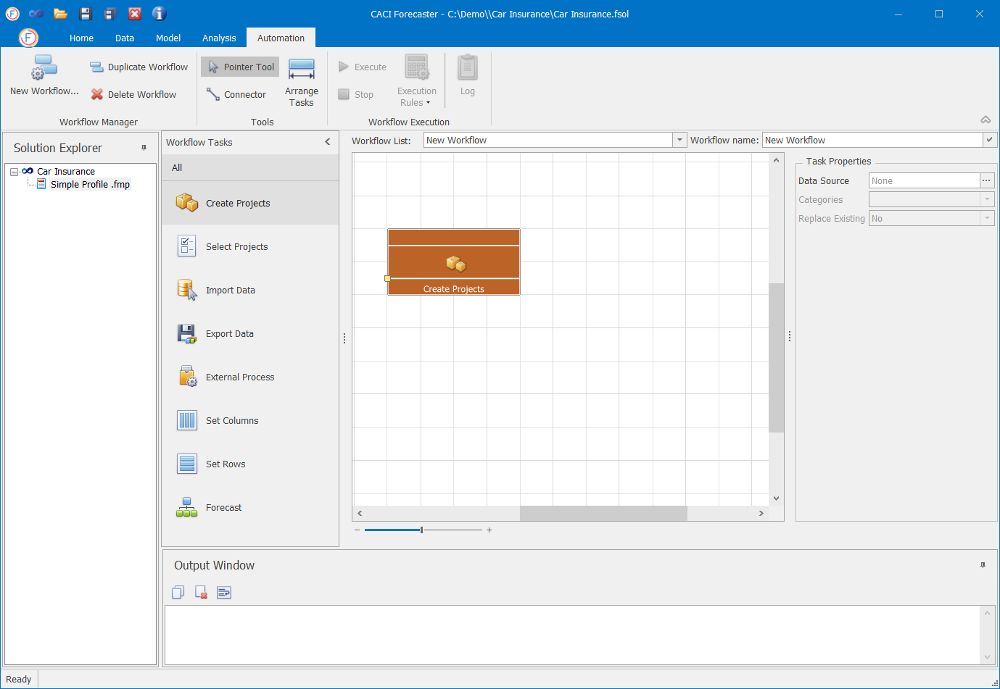
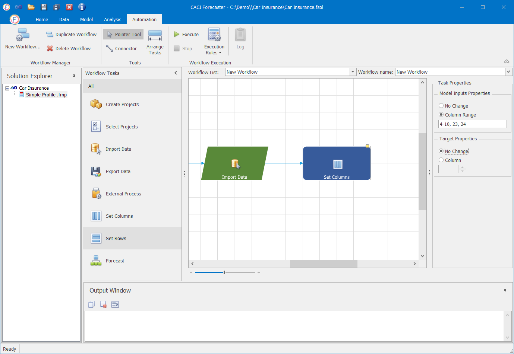
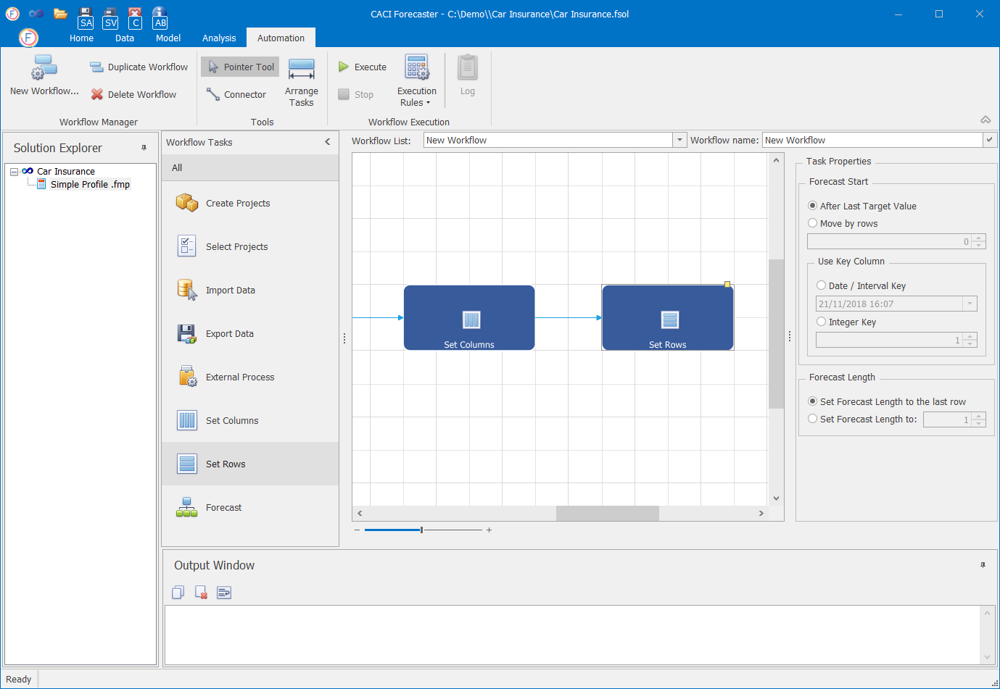

# Workflows

## Workflows

Workflows are used to automate common tasks such as creating a project, re-importation, model re-training, and data export. Workflows are far faster to run, and minimise the potential for error. With Workflows, multiple projects can be created at the same time.

This guide explains how to manage a Workflows in Forecaster.

## Workflow Tasks

To create a Workflow, users have to specify a series of **Workflow Tasks** . A Workflow Task is a specific action that can be performed within Forecaster and used in the Automation to build a Workflow.The output of a Workflow Task is used as input of the next one.

The available Workflow Tasks are depicted in the image below.

 

### Add Workflow Task

Workflow Tasks can be added by simply dragging and dropping them from the Workflow List to the main workflow pane. When a Workflow Tasks is added into the pane, it is automatically added at the end of the workflow and connected with the last Workflow Task.

### Delete Workflow Task
To delete a Workflow Task select the task and press the 'delete' key.

## Creating a Workflow

To initialize a new workflow, click on the **New Workflow** button under the Automation tab, as in the image below.

The title of a Workflow can be changed from the Workflow name field.

Once the Workflow has been initialized, users are able to specify the desired series of **Workflow Tasks**. The next sections describe each one of them in detail.

### Create Projects

To build a new workflow users can either start from Create Projects or Select Projects. The Create Projects is used... 

### Select Projects

As already metioned, to build a new workflow users can either start from Create Projects or Select Projects.

The Select Projects option is used when we need to re-use one or multiple existing Project(s) of a Solution. To do so, simply drage the Select Projects tasks into the main workflow pane.

When the Select Projects task is selected, the relevane Task Properties become available. Here, users can select one or many of the Projects of the Solutions.

### Import Data

### Set Columns

### Set Rows

### Forecast

### Export Data

## Duplicate workflow

## Delete Workflow