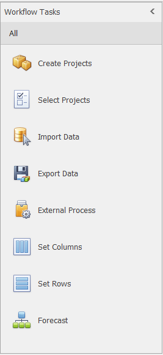
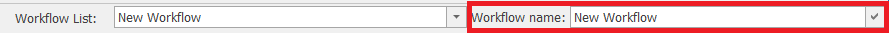
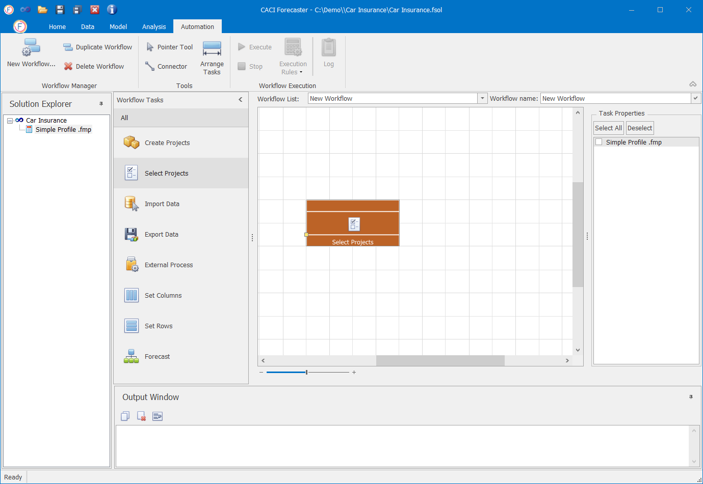
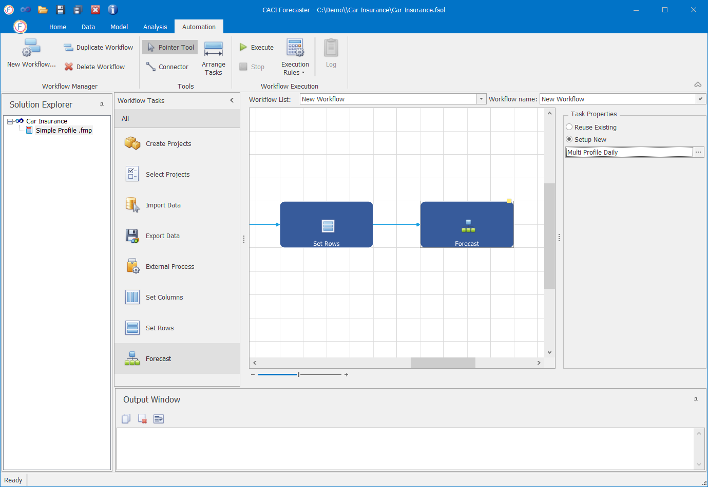
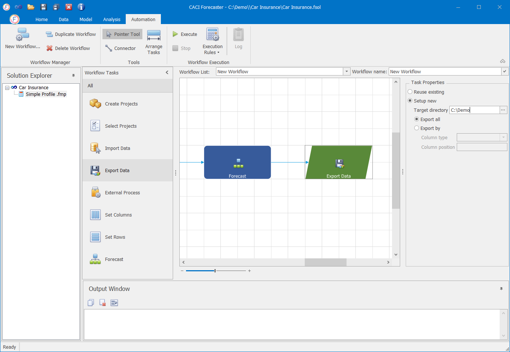

# Workflows

## Workflows

Workflows are used to automate common tasks such as creating a project, re-importation, model re-training, and data export. Workflows are far faster to run, and minimise the potential for error. With Workflows, multiple projects can be created at the same time.

This guide explains how to manage a Workflows in Forecaster.

## Workflow Tasks

To create a Workflow, users have to specify a series of **Workflow Tasks** . A Workflow Task is a specific action that can be performed within Forecaster and used in the Automation to build a Workflow.The output of a Workflow Task is used as input of the next one.

The available Workflow Tasks are depicted in the image below.

 

### Add Workflow Task

Workflow Tasks can be added by simply dragging and dropping them from the Workflow List to the main workflow pane. When a Workflow Tasks is added into the pane, it is automatically added at the end of the workflow and connected with the last Workflow Task.

### Delete Workflow Task
To delete a Workflow Task select the task and press the `delete` key.

## Creating a Workflow

To initialize a new workflow, click on the **New Workflow** button under the Automation tab, as in the image below.

The title of a Workflow can be changed from the Workflow name field.

Once the Workflow has been initialized, users are able to specify the desired sequence of **Workflow Tasks**. The next sections describe each one of them in detail.

### Create Projects

To build a new workflow users can either start from Create Projects or Select Projects. The Create Projects is used... 

### Select Projects

As already metioned, to build a new workflow users can either start from the Create Projects or Select Projects tasks.

The Select Projects option is used when we need to re-use one or multiple existing Project(s) of a Solution. To do so, simply drage the Select Projects tasks into the main workflow pane.

When the Select Projects task is selected, the relevant Task Properties appear in the right-hand pane. Here, users can select one or many of the Projects of the Solutions.

### Import Data

The Import Data is used to specify 

From the Task Properties pane users can specify a new importation procedure, re-use of the existing one by updating the current importation configuration (i.e. data file, script) or re-use of the existing one witha clean import.

### Set Columns

At the Set Columns task users can specify the target column of the model as well as the model inputs. When the 'No Change' option is enabled, the  configuration of the Project is used.

### Set Rows

At the Set Columns task users can specify the starting date and the length of the forecasting period.

### Forecast

At this step of the workflow users are able to select the predicitve model to be used for the forecast. Users can either re-use the model selected within the project or setup a new one. By clicking on the "..." button right next to the model, the Model Parameters screen appears where users can also define or ammend the model's parameters.

### Export Data

After Forecast users can export the results by setting this up at the Export Data task. is used to 

## Duplicate workflow

To create a copy of a workflow click on the **Duplicate Workflow** button as depicted below.

## Delete Workflow

To delete a workflow click on the **Delete Workflow** button as depicted below.

