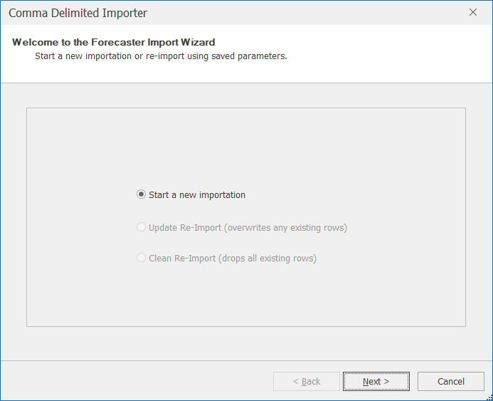
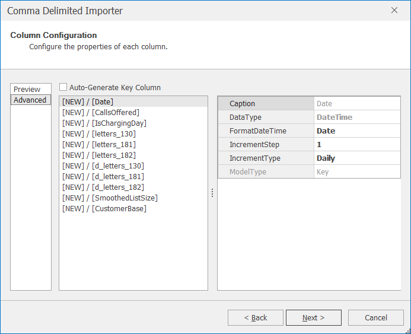
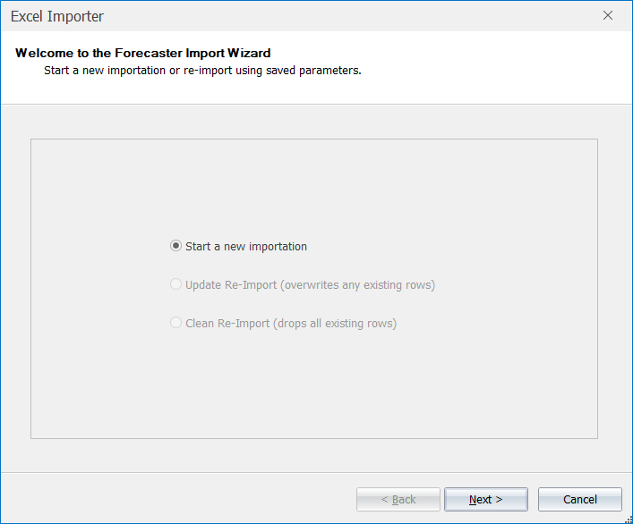
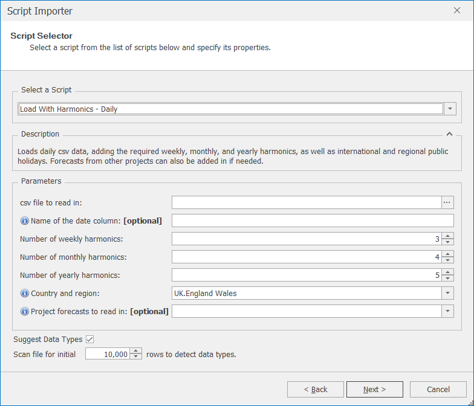

# Data Importers

Data can be imported via three different importers:

| Importer | Description                                                                                                                                                                                                                                                                                                                                                                                                                                                                                                              |
|----------|--------------------------------------------------------------------------------------------------------------------------------------------------------------------------------------------------------------------------------------------------------------------------------------------------------------------------------------------------------------------------------------------------------------------------------------------------------------------------------------------------------------------------|
| Text     | Used to import a text file, for example .csv                                                                                                                                                                                                                                                                                                                                                                                                                                                                             |
| MS Excel | Used to import an Excel file                                                                                                                                                                                                                                                                                                                                                                                                                                                                                             |
| Script   | There are two different types of script:    (1) Load with Harmonics scripts: Enables the user to import their csv file but automatically includes information on bank holidays and harmonics.  Different scripts are available in order to load interval, daily, weekly, or monthly data. More can be found in a separate document on Decomposition Models [1]    (2) Automatic import from databases: Bespoke scripts can be created by CACI.  To discuss extra consultancy, please contact CACI using the contact details in section 9 |
Table 5 Data Importers

Once you have selected which type of import you require (Text, MS Excel, Script), click on Import to open the importation wizard.

If the importation wizard is used on a brand new project (with no existing data), the user will only have the option to start a new importation.  The following sections will describe how to import data into a new project, using the three different importers.
You are able to cancel the import by pressing the cancel button at any time, alternatively if you need to change some wizard settings press the Back button to go back through the importation wizard process.

##### Text Importer
Once the user has selected Text – Import from the Data – Data Importers ribbon, the Comma Delimited Importer will open.  

By clicking on Next, the user will be able to insert the relevant path and file name of the text file (using the Browse button) and set the delimiter.  The default delimiter is comma, but other delimiters are possible (as shown in Figure 13).  By leaving the Suggest Data Types box ticked, the application will automatically define data types for each column.  

Clicking on Next brings you to the Column Configuration options where you will be able to see a preview of the data.  At this stage, a key column needs to be defined.  Where possible, CACI Forecaster will use the date column as the key column.  However, if there is no column which contains unique dates, an auto-generated key column will be used.  If you would prefer to use an auto-generated key column instead on the chosen date column, tick the Auto-Generate Key Column option.
 

By clicking the Advanced view shown in Figure 15, the user is able to adjust the data type of each column, described in Table 6.
 

| Data Type | Description                                                                 | Additional user-defined fields                                                                                                                                                                                                                                                                                                                                                                                                                                                                                                                                                                                                                                                                     |
|-----------|-----------------------------------------------------------------------------|----------------------------------------------------------------------------------------------------------------------------------------------------------------------------------------------------------------------------------------------------------------------------------------------------------------------------------------------------------------------------------------------------------------------------------------------------------------------------------------------------------------------------------------------------------------------------------------------------------------------------------------------------------------------------------------------------|
| Double    | A real or continuous number, i.e. a number with decimal places (e.g. 1.234) | - FormatDecimals: Set the number of decimal places - FormatThousands: Use a comma to separate thousands                                                                                                                                                                                                                                                                                                                                                                                                                                                                                                                                                                                                 |
| Integer   | A whole number, e.g. 1, 2, 3, or 4                                          |        N/A                                                                                                                                                                                                                                                                                                 |
| DateTime  | A variable representing a date or a time                                    | - FormatDateTime: Define whether the variable is a date, time or date and time     - IncrementType: For date variables, you can assign the column to represent days, weeks or months.  If the IncrementStep is set appropriately and the date variable is set to be the key column, then where there are missing date values in the import file, the application will insert a dummy row to represent this date     - IncrementStep: This sets the frequency of the IncrementType value.  For example, for daily data, the user would set the IncrementType to be day and the IncrementStep to be 1. If the data is recorded once every two weeks, then the IncrementType would be week and the IncrementStep 2 
| String    | A non-numeric variable, also known as a categorical variable                |      N/A                                                                                                                                                                                                                          |

Table 6 Data Types

The importation will complete by clicking Next followed by Finish.

##### Excel Importer
Once the user has selected MS Excel – Import from the Data – Data Importers ribbon, the Excel Importer will open. 
 

By clicking on Next, the user will be able to insert the relevant path and file name of the Excel file (using Browse button).  By leaving the Suggest Data Types box ticked, the application will automatically define data types for each column.  
 

The following screen (Figure 19) will ask you to select the relevant worksheet within the Excel file.
 
 **[ IMAGE ]**
Figure 19 Excel Import Wizard - Sheet Selection

Clicking on Next will bring you to the Column Configuration screen which is described in section in more detail in 5.1.1.  The importation will then complete by clicking on Next followed by Finish.
 
 **[ IMAGE ]**
Figure 20 Completing the Excel Importation

##### Script Importer
Once the user has selected Script – Import from the Data – Data Importers ribbon, the Script Importer will open.  
 

By clicking on Next, the user will be able to select the relevant script and input the required parameters in the Parameters field.

 

After clicking on Next, progress of the importation will be visible in the import wizard, similar to that shown in Figure 23.

Clicking on Next will bring you to the Column Configuration screen which is described in section 5.1.1.  The importation will then complete by clicking on Next followed by Finish.

